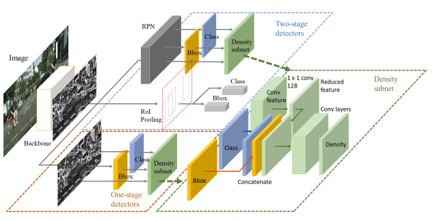
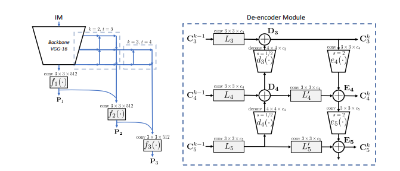

# Pedestrian Detection papers

  This is derivative work of xingkongliang(https://github.com/xingkongliang) 's [Pedestrian-Detection](https://github.com/xingkongliang/Pedestrian-Detection)
<h3><b><u>TABLE OF CONTENTS</u></b></h3>
<a href="#Datasets" >&#9635 Datasets</a> 
<a href="#PaperList" >&#9635 Paper List</a> 
<a href="#PaperwithCode" >&#9635 Paper with Code</a> 

## Datasets

### CityPersons

CityPersons数据集是在Cityscapes数据集基础上建立的，使用了Cityscapes数据集的数据，对一些类别进行了精确的标注。该数据集是在[CVPR-2017] CityPersons: A Diverse Dataset for Pedestrian Detection这篇论文中提出的，更多细节可以通过阅读该论文了解。

上图中左侧是行人标注，右侧是原始的CityScapes数据集。

- [**标注和评估文件**](https://bitbucket.org/shanshanzhang/citypersons)
- [**数据集下载**](https://www.cityscapes-dataset.com/)

<a href="Format.md" ><button style="font-size: 20px; color: white; background-color: steelblue; height: 50px; border-radius: 10px; " > >>> Format of Datasets </button></a>

### Caltech
- [**Caltech官网**](http://www.vision.caltech.edu/Image_Datasets/CaltechPedestrians/)
更所细节请阅读这篇论文，
[[TAPAMI-2012] Pedestrian Detection: An Evaluation of the State of the Art
](http://www.vision.caltech.edu/Image_Datasets/CaltechPedestrians/files/PAMI12pedestrians.pdf)

## 性能比较

<a href="PerformanceofCaltech.md" ><button style="font-size: 20px; color: white; background-color: steelblue; height: 50px; border-radius: 10px; " > >>> Performance of Caltech </button></a>

### KITTI

- [**KITTI官网**](http://www.cvlibs.net/datasets/kitti/) 

## 性能比较

<a href="PerformanceofKITTI.md" ><button style="font-size: 20px; color: white; background-color: steelblue; height: 50px; border-radius: 10px; " > >>> Performance of KITTI </button></a>

## Paper List
- [CVPR-2019] High-level Semantic Feature Detection:A New Perspective for Pedestrian Detection
- [CVPR-2019] SSA-CNN: Semantic Self-Attention CNN for Pedestrian Detection
- [CVPR-2019] Pedestrian Detection in Thermal Images using Saliency Maps
- [TIP-2018] Too Far to See? Not Really:- Pedestrian Detection with Scale-Aware Localization Policy
- [ECCV-2018] Bi-box Regression for Pedestrian Detection and Occlusion Estimation
- [ECCV-2018] Learning Efficient Single-stage Pedestrian Detectors by Asymptotic Localization Fitting
- [ECCV-2018] Graininess-Aware Deep Feature Learning for Pedestrian Detection
- [ECCV-2018] Occlusion-aware R-CNN: Detecting Pedestrians in a Crowd
- [ECCV-2018] Small-scale Pedestrian Detection Based on Somatic Topology Localization and Temporal Feature Aggregation
- [CVPR-2018] Improving Occlusion and Hard Negative Handling for Single-Stage Pedestrian Detectors
- [CVPR-2018] Occluded Pedestrian Detection Through Guided Attention in CNNs
- [CVPR-2018] Repulsion Loss: Detecting Pedestrians in a Crowd
- [TCSVT-2018] Pushing the Limits of Deep CNNs for Pedestrian Detection
- [Trans Multimedia-2018] Scale-aware Fast R-CNN for Pedestrian Detection
- [TPAMI-2017] Jointly Learning Deep Features, Deformable Parts, Occlusion and Classification for Pedestrian Detection
- [BMVC-2017] PCN: Part and Context Information for Pedestrian Detection with CNNs
- [CVPR-2017] CityPersons: A Diverse Dataset for Pedestrian Detection
- [CVPR-2017] Learning Cross-Modal Deep Representations for Robust Pedestrian Detection
- [CVPR-2017] What Can Help Pedestrian Detection?
- [ICCV-2017] Multi-label Learning of Part Detectors for Heavily Occluded Pedestrian Detection
- [ICCV-2017] Illuminating Pedestrians via Simultaneous Detection & Segmentation
- [TPAMI-2017] Towards Reaching Human Performance in Pedestrian Detection
- [Transactions on Multimedia-2017] Scale-Aware Fast R-CNN for Pedestrian Detection
- [CVPR-2016] Semantic Channels for Fast Pedestrian Detection
- [CVPR-2016] How Far are We from Solving Pedestrian Detection?
- ![CVPR-2016] Pedestrian Detection Inspired by Appearance Constancy and Shape Symmetry
- ![CVPR-2016] Semantic Channels for Fast Pedestrian Detection
- ![ECCV-2016] Is Faster R-CNN Doing Well for Pedestrian Detection?
- [CVPR-2015] Taking a Deeper Look at Pedestrians
- ![ICCV-2015] Learning Complexity-Aware Cascades for Deep Pedestrian Detection
- [ICCV-2015] Deep Learning Strong Parts for Pedestrian Detection
- ![ECCV-2014] Deep Learning of Scene-specific Classifier for Pedestrian Detection
- [CVPR-2013] Joint Deep Learning for Pedestrian Detection
- [CVPR-2012] A Discriminative Deep Model for Pedestrian Detection with Occlusion Handling
- [CVPR-2010] Multi-Cue Pedestrian Classification With Partial Occlusion Handling
- [CVPR-2009] Pedestrian detection: A benchmark
- [CVPR-2008] People-Tracking-by-Detection and People-Detection-by-Tracking
- [ECCV-2006] Human Detection Using Oriented Histograms of Flow and Appearance
- [CVPR-2005] Histograms of Oriented Gradients for Human Detection

## Paper with Code

### [CVPR-2019] Adaptive NMS: Refining Pedestrian Detection in a Crowd

- paper: https://arxiv.org/abs/1904.03629

### [CVPR-2019] High-level Semantic Feature Detection:A New Perspective for Pedestrian Detection

- paper: https://arxiv.org/abs/1904.02948
- github: https://github.com/liuwei16/CSP

### [CVPR-2019] SSA-CNN: Semantic Self-Attention CNN for Pedestrian Detection

- paper: https://arxiv.org/abs/1902.09080v1

### [CVPR-2019] Pedestrian Detection in Thermal Images using Saliency Maps

- paper: https://arxiv.org/abs/1904.06859

### [CVPR-2019] Pedestrian Detection with Autoregressive Network Phases

- paper: https://arxiv.org/abs/1812.00440
- matlab github: https://github.com/garrickbrazil/AR-Ped

### [TIP-2018] Too Far to See? Not Really:- Pedestrian Detection with Scale-Aware Localization Policy

- arxiv: https://arxiv.org/abs/1709.00235
- paper: https://ieeexplore.ieee.org/document/8328854/

### [Transactions on Multimedia-2017] Scale-Aware Fast R-CNN for Pedestrian Detection

- arxiv: https://arxiv.org/abs/1510.08160
- paper: https://ieeexplore.ieee.org/abstract/document/8060595/

 
 

### [ECCV-2018] Bi-box Regression for Pedestrian Detection and Occlusion Estimation

- arxiv:
- paper:http://openaccess.thecvf.com/content_ECCV_2018/papers/CHUNLUAN_ZHOU_Bi-box_Regression_for_ECCV_2018_paper.pdf
- slides:
- pytorch-github:https://github.com/rainofmine/Bi-box_Regression

### [ECCV-2018] Learning Efficient Single-stage Pedestrian Detectors by Asymptotic Localization Fitting

- arxiv:
- paper:http://openaccess.thecvf.com/content_ECCV_2018/papers/Wei_Liu_Learning_Efficient_Single-stage_ECCV_2018_paper.pdf
- project website:
- slides:
- github:

### [ECCV-2018] Graininess-Aware Deep Feature Learning for Pedestrian Detection

- arxiv:
- paper:http://openaccess.thecvf.com/content_ECCV_2018/papers/Chunze_Lin_Graininess-Aware_Deep_Feature_ECCV_2018_paper.pdf
- project website:
- slides:
- github:

### [ECCV-2018] Occlusion-aware R-CNN: Detecting Pedestrians in a Crowd

- arxiv: http://arxiv.org/abs/1807.08407

### [ECCV-2018] Small-scale Pedestrian Detection Based on Somatic Topology Localization and Temporal Feature Aggregation

- arxiv:https://arxiv.org/abs/1807.01438
- project website:
- slides:
- github caffe:

 
 

### [CVPR-2018] Improving Occlusion and Hard Negative Handling for Single-Stage Pedestrian Detectors

- arxiv:
- paper: http://vision.snu.ac.kr/projects/partgridnet/data/noh_2018.pdf
- project website: http://vision.snu.ac.kr/projects/partgridnet/
- slides:
- github caffe:

 
 

### [CVPR-2018] Occluded Pedestrian Detection Through Guided Attention in CNNs

- arxiv:
- paper: http://openaccess.thecvf.com/content_cvpr_2018/papers/Zhang_Occluded_Pedestrian_Detection_CVPR_2018_paper.pdf
- project website:
- slides:
- github caffe:

 
 

### [CVPR-2018] Repulsion Loss: Detecting Pedestrians in a Crowd

- arxiv:http://arxiv.org/abs/1711.07752
- project website:
- slides:
- github caffe:
- implemented with SSD pytorch:https://github.com/bailvwangzi/repulsion_loss_ssd

 
 

### [TPAMI-2017] Jointly Learning Deep Features, Deformable Parts, Occlusion and Classification for Pedestrian Detection

- paper: https://ieeexplore.ieee.org/abstract/document/8008790/
- project website:
- slides:
- github caffe:

 
 
 
 
 
 

### [BMVC-2017] PCN: Part and Context Information for Pedestrian Detection with CNNs

- arxiv: https://arxiv.org/abs/1804.044838
- project website:
- slides:
- github caffe:

 
 
 

### [CVPR-2017] CityPersons: A Diverse Dataset for Pedestrian Detection

- arxiv: http://arxiv.org/abs/1702.05693
- project website:
- slides:
- github caffe:

 
 
 

---

### [CVPR-2017] Learning Cross-Modal Deep Representations for Robust Pedestrian Detection

- arxiv: https://arxiv.org/abs/1704.02431
- project website:
- slides:
- github caffe:

### [CVPR-2017] What Can Help Pedestrian Detection?

- arxiv: https://arxiv.org/abs/1704.02431
- project website:
- slides:
- github caffe:

### [TPAMI-2017] Towards Reaching Human Performance in Pedestrian Detection

- paper: http://ieeexplore.ieee.org/document/7917260/
- arxiv:
- project website:
- slides:
- github caffe:

### [ICCV-2017] Multi-label Learning of Part Detectors for Heavily Occluded Pedestrian Detection
- paper: http://openaccess.thecvf.com/content_ICCV_2017/papers/Zhou_Multi-Label_Learning_of_ICCV_2017_paper.pdf
- arxiv:
- project website:
- slides:

### [ICCV-2017]Illuminating Pedestrians via Simultaneous Detection & Segmentation

- arxiv: https://arxiv.org/abs/1706.08564
- project website: http://cvlab.cse.msu.edu/project-pedestrian-detection.html
- slides:
- github caffe: https://github.com/garrickbrazil/SDS-RCNN

### [CVPR-2016] Semantic Channels for Fast Pedestrian Detection

- paper: https://www.cv-foundation.org/openaccess/content_cvpr_2016/papers/Costea_Semantic_Channels_for_CVPR_2016_paper.pdf
- project website:
- slides:
- github caffe:

### [CVPR-2016] Pedestrian Detection Inspired by Appearance Constancy and Shape Symmetry

- paper: http://openaccess.thecvf.com/content_cvpr_2016/papers/Cao_Pedestrian_Detection_Inspired_CVPR_2016_paper.pdf
- project website:
- slides:

### [CVPR-2016] Semantic Channels for Fast Pedestrian Detection

- paper: http://openaccess.thecvf.com/content_cvpr_2016/papers/Costea_Semantic_Channels_for_CVPR_2016_paper.pdf
- project website:
- slides:

### [ECCV-2016] Is Faster R-CNN Doing Well for Pedestrian Detection?

- paper: https://arxiv.org/abs/1607.07032
- project website:
- matlab implementation on caffe-Faster: https://github.com/zhangliliang/RPN_BF/tree/RPN-pedestrian
- slides:

### [CVPR-2016] How Far are We from Solving Pedestrian Detection?

- paper: https://www.cv-foundation.org/openaccess/content_cvpr_2016/app/S06-29.pdf
- project website:
- slides:
- github caffe:

### [ICCV-2015] Learning Complexity-Aware Cascades for Deep Pedestrian Detection

- paper: http://openaccess.thecvf.com/content_iccv_2015/papers/Cai_Learning_Complexity-Aware_Cascades_ICCV_2015_paper.pdf
- project website:
- slides:

### [ICCV-2015] Deep Learning Strong Parts for Pedestrian Detection

- paper: https://www.cv-foundation.org/openaccess/content_iccv_2015/html/Tian_Deep_Learning_Strong_ICCV_2015_paper.htmler.html
- project website:
- slides:
- github caffe:
 

### [CVPR-2013] Joint Deep Learning for Pedestrian Detection Wanli

- paper: https://www.cv-foundation.org/openaccess/content_iccv_2013/html/Ouyang_Joint_Deep_Learning_2013_ICCV_paper.html
- project website:
- slides:
- github caffe:
 
 
 
 
 

### [CVPR-2012] A Discriminative Deep Model for Pedestrian Detection with Occlusion Handling

- paper: http://mmlab.ie.cuhk.edu.hk/pdf/ouyangWcvpr2012.pdf
- paper: https://ieeexplore.ieee.org/abstract/document/6248062/
- project website:
- slides:
- github caffe:
 
 
 
 
 
 
 

### [CVPR-2010] Multi-Cue Pedestrian Classification With Partial Occlusion Handling

- paper: https://ieeexplore.ieee.org/abstract/document/5540111/
- project website:
- slides:
- github caffe:
 
 
 

